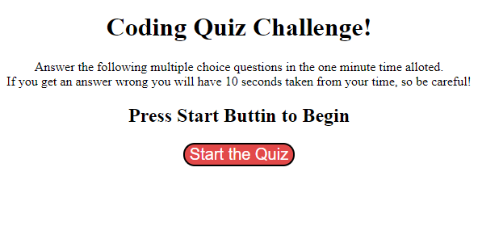
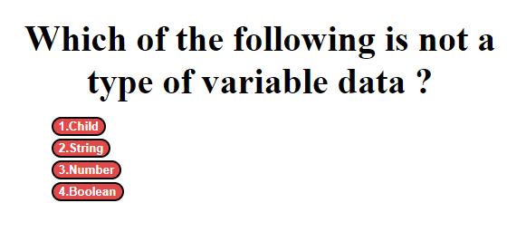
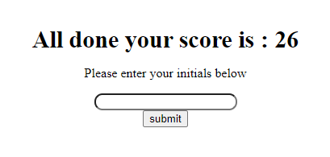

# Coding-Quiz
This project is a quiz with coding questions. It keeps score by counting the time left when all answers are completed.

## Table of contents
* Description
* Technologies
* Link To Deployed Website
* Acknowledgments

## Description
When you open the link you will be shown a page and the rules of the game to be played along with a start button to begin the game.

