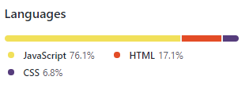

# Coding-Quiz
This project is a quiz with coding questions. It keeps score by counting the time left when all answers are completed. This code was written completely from scratch.

## Table of contents
* Description
* Technologies
* Link To Deployed Website
* Acknowledgments

## Description
When you open the link you will be shown a page and the rules of the game to be played along with a start button to begin the game.

Note that if an incorrect answer is clicked the user will lose 10 seconds off their time.

Shown below is an example of one of the questions. Use the mouse to click on the correct response. After answering you will be taken automatically to the next question. There are five questions in total.

After all the questions have been completed or the time has run out you will be taken to screen shown below which will ask to giv your initials to be taken with your score to the Leaderboard.

Finally you will betaken to the leaderboard where all past scores sre shown. User will have the choice to delete the past scores and to play the game again. 

## Technologies
The technologies used and what percetages each was used is listed below.

## Acknowledgments
Andres Jimenez (Tudor)  
Kirtley Adams (Teaching Assistant)  
Dan Kaltenbaugh (Instructor) 
Special thanks to Teaching Assistant George Yoo for a long and informative Discord session